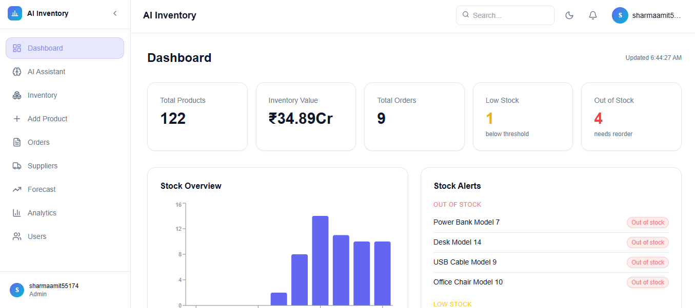
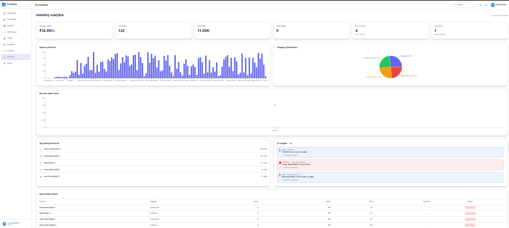
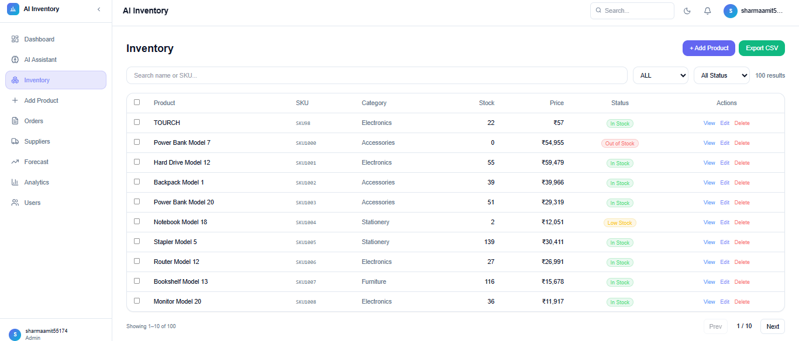
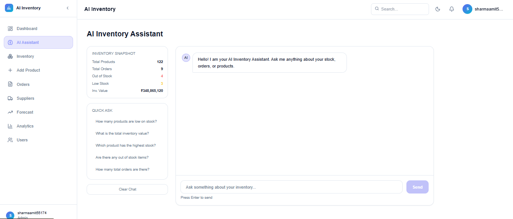

# 🤖 AI Inventory Management System

> A full-stack AI-powered inventory management system with demand forecasting, real-time analytics, automated alerts, and role-based access control.


---

## 🌐 Live Demo

🔗 **Frontend:** [https://your-app.vercel.app](https://your-app.vercel.app)  
🔗 **Backend API:** [https://your-backend.render.com/docs](https://your-backend.render.com/docs)

---

## ✨ Features

### 🔐 Authentication & Security
- JWT-based login with **Remember Me (7 days)**
- **OTP-based forgot password** via Gmail SMTP
- Admin notification on every password reset request
- Role-based access: `Admin` `Manager` `Staff` `Viewer`
- bcrypt password hashing

### 📦 Inventory Management
- Add, edit, soft-delete products
- SKU-based duplicate detection
- Bulk CSV upload with row-wise error reporting
- Stock history with full audit trail (before/after values)
- Reorder point & reorder quantity per product

### 📊 AI Demand Forecasting
- **ARIMA model** with auto order selection
- Per-product forecast with confidence intervals
- Days-of-stock-left prediction
- Fallback to Moving Average for short data series

### 📈 Analytics Dashboard
- KPI cards: inventory value, SKUs, orders, out-of-stock count
- Bar chart, Pie chart, Line chart (Recharts)
- Top selling products, turnover rate, stock status table
- AI-generated insights (danger / warning / info)

### 🔔 Smart Notifications
- Priority-based alerts: Critical → Warning → Info
- Out-of-stock, low stock, dead stock detection
- Lightweight navbar badge (polling every 30s)

### 🤖 AI Assistant
- Natural language inventory queries
- Rule-based engine: stock levels, value, trends
- Inventory snapshot sidebar
- Quick-ask prompts

### 👥 User Management
- Create / update / deactivate users
- Inline role change from table
- Last login tracking

---

## 🛠️ Tech Stack

| Layer | Technology |
|-------|-----------|
| Frontend | React.js, TailwindCSS, Recharts, Framer Motion |
| Backend | FastAPI, SQLAlchemy, SQLite |
| Auth | JWT (PyJWT), bcrypt |
| ML | ARIMA (statsmodels), pandas, numpy |
| Email | Gmail SMTP (smtplib) |
| Deploy | Vercel (frontend), Render (backend) |

---

## 📁 Project Structure

```
ai-inventory-system/
├── frontend/
│   ├── src/
│   │   ├── components/     # Layout, Header, Sidebar, ProtectedRoute
│   │   ├── context/        # AuthContext
│   │   ├── pages/          # Dashboard, Inventory, Orders, Analytics...
│   │   ├── services/       # productAPI.js (axios)
│   │   └── hooks/
│   └── ...
│
├── backend/
│   └── app/
│       ├── routes/         # auth, product, orders, suppliers, analytics...
│       ├── ml/             # forecast_model.py (ARIMA)
│       ├── models.py       # SQLAlchemy models
│       ├── schemas.py      # Pydantic schemas
│       ├── database.py     # DB config
│       └── main.py         # FastAPI app
└── README.md
```

---

## 🚀 Getting Started

### Prerequisites
- Python 3.10+
- Node.js 18+
- Git

---

### Backend Setup

```bash
# 1. Clone the repo
git clone https://github.com/your-username/ai-inventory-system.git
cd ai-inventory-system/backend

# 2. Install dependencies
pip install fastapi uvicorn sqlalchemy pydantic bcrypt PyJWT
pip install pandas numpy statsmodels

# 3. Create .env file
```

Create `backend/.env`:
```env
JWT_SECRET=your-secret-key-here
SENDER_EMAIL=your-gmail@gmail.com
SENDER_PASSWORD=your-16-digit-app-password
APP_NAME=AI Inventory System
FRONTEND_URL=http://localhost:5173
```

```bash
# 4. Run migration (first time only)
python migrate.py

# 5. Start server
python -m uvicorn app.main:app --reload --port 8001
```

API docs: `http://127.0.0.1:8001/docs`

---

### Frontend Setup

```bash
cd ../frontend

# 1. Install dependencies
npm install

# 2. Create .env file
```

Create `frontend/.env`:
```env
VITE_API_URL=http://127.0.0.1:8001
```

```bash
# 3. Start dev server
npm run dev
```

App: `http://localhost:5173`

---

## 🔑 Default Login

> Create your first admin user via API:
> `POST /auth/create-user` with `{ "email": "admin@test.com", "password": "123456", "role": "admin" }`

---

## 📸 Screenshots

| Dashboard | Analytics |
|-----------|-----------|
|  |  |

| Inventory | AI Assistant |
|-----------|-------------|
|  |  |

---

## 🌍 Deployment

### Frontend → Vercel
```bash
cd frontend
npm run build
# Push to GitHub → Vercel auto-deploys
```

### Backend → Render
1. New Web Service → Connect GitHub repo
2. Root directory: `backend`
3. Build command: `pip install -r requirements.txt`
4. Start command: `uvicorn app.main:app --host 0.0.0.0 --port 10000`
5. Add environment variables from `.env`

---

## 📋 API Endpoints

| Method | Endpoint | Description |
|--------|----------|-------------|
| POST | `/auth/login` | Login with JWT |
| POST | `/auth/forgot-password` | Send OTP |
| POST | `/auth/verify-otp` | Verify OTP |
| POST | `/auth/reset-password` | Reset password |
| GET | `/products/` | Get all products |
| POST | `/products/` | Create product |
| GET | `/analytics/` | Full analytics |
| GET | `/forecast/{id}` | Product forecast |
| GET | `/notifications/` | Get alerts |
| GET | `/ai/ask?question=` | AI assistant |

---

## 👨‍💻 Author

**Amit Sharma**  
📧 sharmaamit55174@gmail.com  
🔗 [LinkedIn](https://linkedin.com/in/your-profile)  
🐙 [GitHub](https://github.com/your-username)

---

## 📄 License

MIT License — feel free to use and modify.

---

<p align="center">Made with ❤️ using React + FastAPI</p>